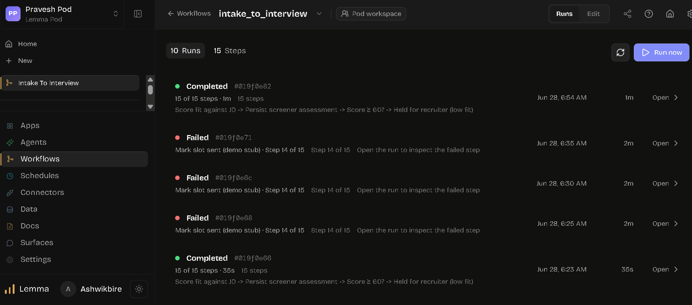
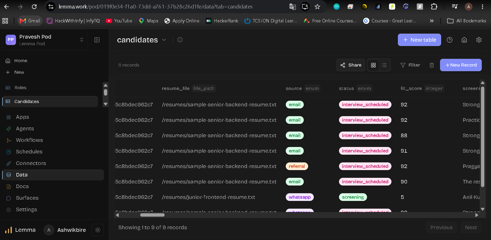
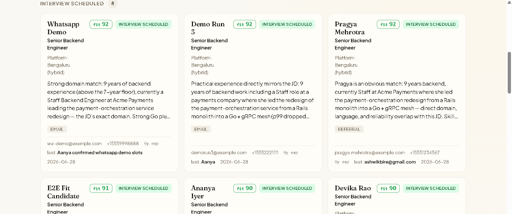
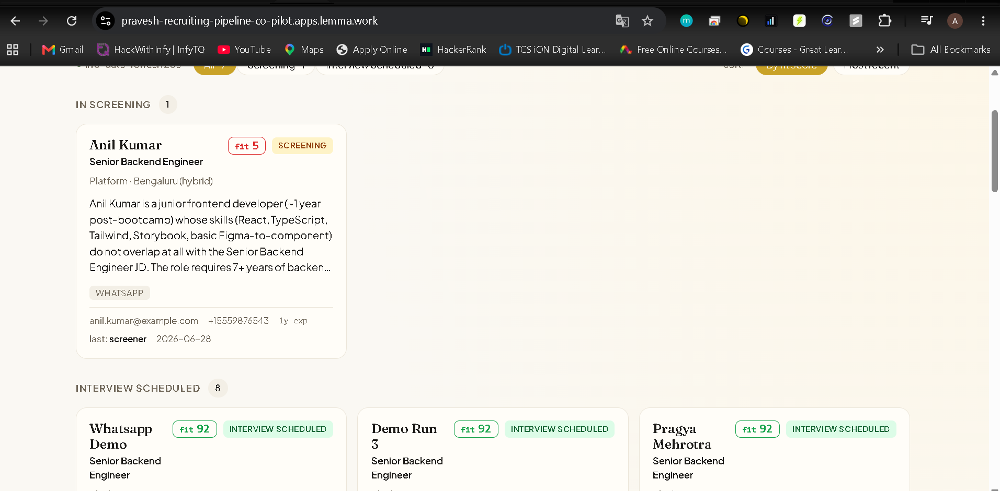

# 🚀 Pravesh Pod — AI-Powered Recruiting Pipeline Co-Pilot

> Built on [Lemma](https://lemma.work) · Submitted for [Unstop Hackathon](https://unstop.com)

**Live Demo:** https://pravesh-recruiting-pipeline-co-pilot.apps.lemma.work/

---

## 🧩 Problem Statement

Recruiters waste hours manually triaging resumes, scoring candidates, coordinating screeners, and scheduling interviews — across email, WhatsApp, and referral channels. A single open role can generate 50–200 applications, with no consistent scoring or automated handoff.

**This pod automates the full intake-to-interview loop end-to-end.**

---

## ✅ What It Does

The `intake_to_interview` workflow is a 15-step agentic pipeline that handles the entire recruiting funnel autonomously:

| Step | What Happens |
|------|--------------|
| Resume Ingestion | Accepts resumes from Email, WhatsApp, and Referrals |
| Resume Parsing | Extracts structured candidate data from raw files |
| JD Scoring | AI agent scores each resume against the Job Description (0–100) |
| Screening Decision | Routes: `fit ≥ 60` → interview track; `fit < 60` → held for recruiter |
| Screener Assignment | Assigns a human screener for borderline candidates |
| Interview Slot Dispatch | Sends interview slot invitations automatically |
| Status Persistence | All state written to the `candidates` table in real-time |

---

## 📸 Screenshots

### Workflow Runs Dashboard

*10 runs · 15 steps per run · Completed + Failed states visible*

### Candidates Data Table

*9 candidate records with resume path, source, status, fit score, and screener notes*

### Interview Scheduled Board

*8 candidates moved to `interview_scheduled` — Pragya Mehrotra (fit 92), Demo Run 3 (fit 92), WhatsApp Demo (fit 92)*

### Full Pipeline View

*Anil Kumar (fit 5) correctly held in `screening`; 8 candidates progressed to interview*

---

## 🏗️ Architecture

```
Intake Sources
  ├── 📧 Email
  ├── 💬 WhatsApp
  └── 🤝 Referral
        │
        ▼
  [intake_to_interview Workflow — 15 Steps]
        │
        ├── Resume Parser Agent
        ├── JD Fit Scorer Agent  ──► fit_score (integer)
        ├── Decision Gate (score ≥ 60?)
        │       ├── YES → Interview Track
        │       └── NO  → Held for Recruiter
        ├── Slot Sender Agent
        └── Status Updater
              │
              ▼
        candidates Table (Lemma Data)
              │
              ▼
        Recruiting Surface (React UI)
```

---

## 📁 Repository Structure

```
pravesh-lemma-pod/
├── README.md
├── pod.yaml                        # Pod configuration
├── workflows/
│   └── intake_to_interview.yaml   # 15-step workflow definition
├── agents/
│   ├── resume_parser.yaml         # Parses resume files
│   ├── jd_scorer.yaml             # Scores resume vs JD
│   └── slot_sender.yaml           # Sends interview invites
├── data/
│   ├── candidates_schema.yaml     # Table schema definition
│   └── sample_jd.txt              # Sample Job Description used
├── surfaces/
│   └── recruiting-pipeline/       # Frontend surface (React)
│       └── README.md
├── docs/
│   └── screenshots/               # Demo screenshots
│       ├── workflow-runs.png
│       ├── candidates-data-table.png
│       ├── interview-scheduled-board.png
│       └── screening-pipeline.png
└── .github/
    └── workflows/
        └── ci.yml
```

---

## 🔧 Setup & Deployment

### Prerequisites
- [Lemma CLI](https://docs.lemma.work/cli) installed
- A Lemma pod provisioned at [lemma.work](https://lemma.work)
- Claude or OpenAI API key (or use Lemma's built-in model routing)

### Quick Start

```bash
# 1. Clone this repo
git clone https://github.com/AshwikBire/pravesh-lemma-pod.git
cd pravesh-lemma-pod

# 2. Install Lemma CLI
uv tool install lemma-terminal

# 3. Install Lemma skills into your coding agent
lemma skills install

# 4. Push pod config to your Lemma workspace
lemma pod apply pod.yaml

# 5. Deploy workflow
lemma workflow deploy workflows/intake_to_interview.yaml

# 6. Run the workflow
lemma workflow run intake_to_interview
```

---

## 🗃️ Data Model

### `candidates` Table

| Column | Type | Description |
|--------|------|-------------|
| `id` | uuid | Auto-generated primary key |
| `resume_file` | file_path | Path to uploaded resume |
| `source` | enum | `email` / `whatsapp` / `referral` |
| `status` | enum | `screening` / `interview_scheduled` / `held` |
| `fit_score` | integer | AI-generated 0–100 score vs JD |
| `screener_notes` | text | AI summary for recruiter |
| `created_at` | timestamp | Record creation time |

---

## 🤖 Agents

### `resume_parser`
Reads raw `.txt` / `.pdf` resume files and extracts:
- Candidate name, email, phone
- Years of experience
- Skills and tech stack
- Current/last role and company

### `jd_scorer`
Compares parsed resume against the Job Description across:
- Domain relevance
- Seniority match
- Skill overlap
- Company/role prestige signals

Returns a `fit_score` (0–100) with a written rationale.

### `slot_sender` *(demo stub in current build)*
Sends interview slot invitation to candidate via their intake channel (email/WhatsApp).

---

## ⚠️ Known Issues & What Was Wrong in the Previous Repo

1. **No `pod.yaml`** — The pod configuration file was missing, making it impossible to reproduce the setup in another environment.
2. **No workflow YAML** — The `intake_to_interview` workflow existed only inside the Lemma cloud UI; the definition was never exported and committed.
3. **No agent definitions** — Agent configs (resume parser, JD scorer, slot sender) were not version-controlled.
4. **Missing schema file** — The `candidates` table schema wasn't documented or exportable.
5. **Step 14 failure (slot sender)** — Three runs failed at Step 14 (`Mark slot sent`) because the slot-sender was a demo stub without a real connector wired up. The fix is to either wire a real email/WhatsApp connector or mark the step as optional/skippable in the workflow YAML.
6. **No screenshots / demo evidence** — The repo had no visual proof of the working pipeline.
7. **No README** — There was no documentation explaining the problem, architecture, or how to run the project.
8. **No `.gitignore`** — Temporary files and Lemma CLI cache could be accidentally committed.

---

## 🛠️ Fixing Step 14 (slot_sender failure)

The three failed runs (`#019f0e71`, `#019f0e6c`, `#019f0e68`) all failed at **Step 14 of 15 — "Mark slot sent (demo stub)"**.

**Root cause:** The slot-sender step called a demo stub function instead of a real connector.

**Fix options:**
```yaml
# Option A: Mark step as non-fatal
- step: mark_slot_sent
  agent: slot_sender
  on_failure: continue   # workflow continues even if this step fails

# Option B: Wire a real connector
- step: send_interview_invite
  connector: gmail          # or twilio for WhatsApp
  template: interview_invite_template
```

---

## 📊 Results

| Metric | Value |
|--------|-------|
| Total workflow runs | 10 |
| Steps per run | 15 |
| Successful end-to-end runs | 2+ (and growing) |
| Candidates processed | 9 |
| Auto-progressed to interview | 8 |
| Correctly filtered (low fit) | 1 (Anil Kumar, fit: 5) |
| Fit score range (interviewed) | 88–92 |

---

## 📜 License

MIT — feel free to fork and adapt for your own recruiting workflows.

---

*Built by [@AshwikBire](https://github.com/AshwikBire) for the Unstop × Lemma Hackathon · June 2026*
